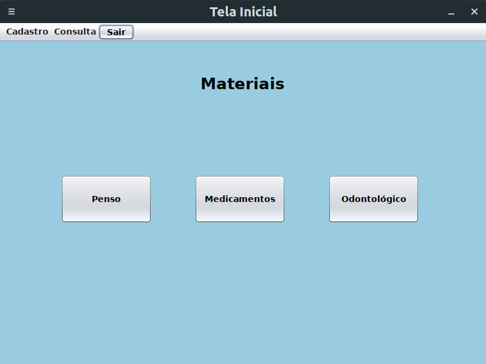

# Controle Farmacia
Projeto desenvolvido nas disciplinas Processo de Desenvolvimento de Software e Arquitetura de Software, no curso de Sistemas de Informação, em UFRPE/UAST.

# Ferramentas utilizadas no desenvolvimento
- Eclipe IDE para edição de códigos (Linguagem Java);
- MySQL Workbench para modelagem e criação do banco de dados (MySql);
- Biblioteca JDBC para conexão com o Banco de Dados;

# Screenshots

### Tela inicial

### Cadastrar Fornecedor

### Consulta Fornecedor

### Consulta Penso (Materiais, Utensílios, etc.)

